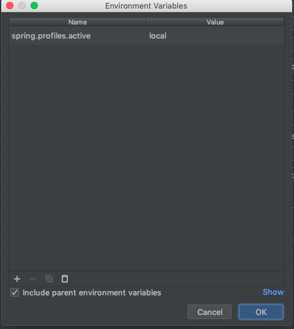

# Fillexc

[](https://app.codacy.com/app/felipesena/fillexc?utm_source=github.com&utm_medium=referral&utm_content=felipesena/fillexc&utm_campaign=Badge_Grade_Dashboard)
[](https://travis-ci.org/felipesena/fillexc)

This repo is a improvement of [Provider](https://github.com/felipesena/Provider), it's a RESTful API
for the web site that will be create in the future. Besides the improvement, this is a way that i found
to learn new technologies such as: [Docker](https://docs.docker.com), [Spring](https://spring.io), 
[Liquibase](https://www.liquibase.org/documentation/index.html) and others.

## Running in IntelliJ

You need to add `spring.profiles.active=local` in `environment variables` in configuration in IntelliJ in order to run/debug it in your
machine. This is because the real database is in Docker, since you don't want to start new container to run/debug
you just need to use the `local` profile that is configured an in-memory database (H2) to get life easier.

<p align="center">
  <a>
    
  </a>  
</p>

## Running in Docker

To run it in Docker you need to generate the image for Fillexc first and then run it with `docker-compose`, 
for it just run the command below:

```sh
mvn clean package docker:build -Dspring.profiles.active=local
docker-compose up -d
```
